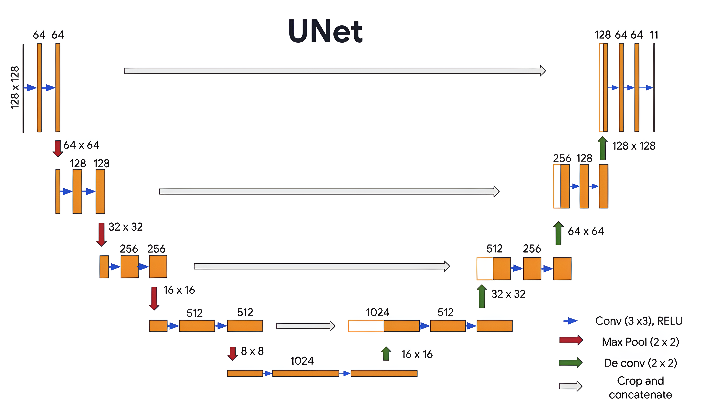
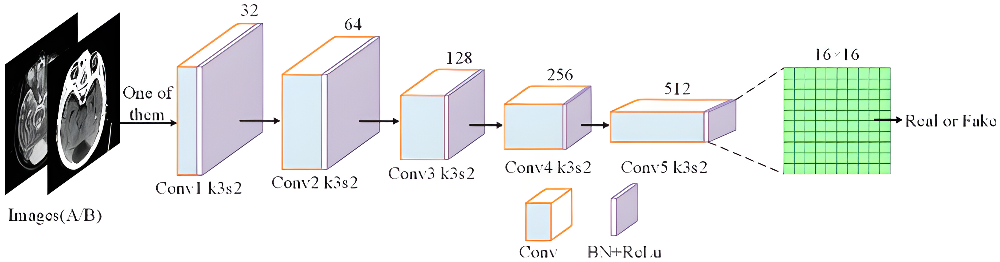
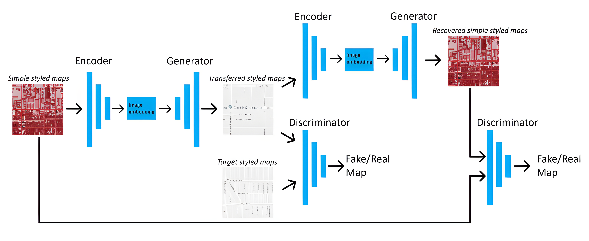
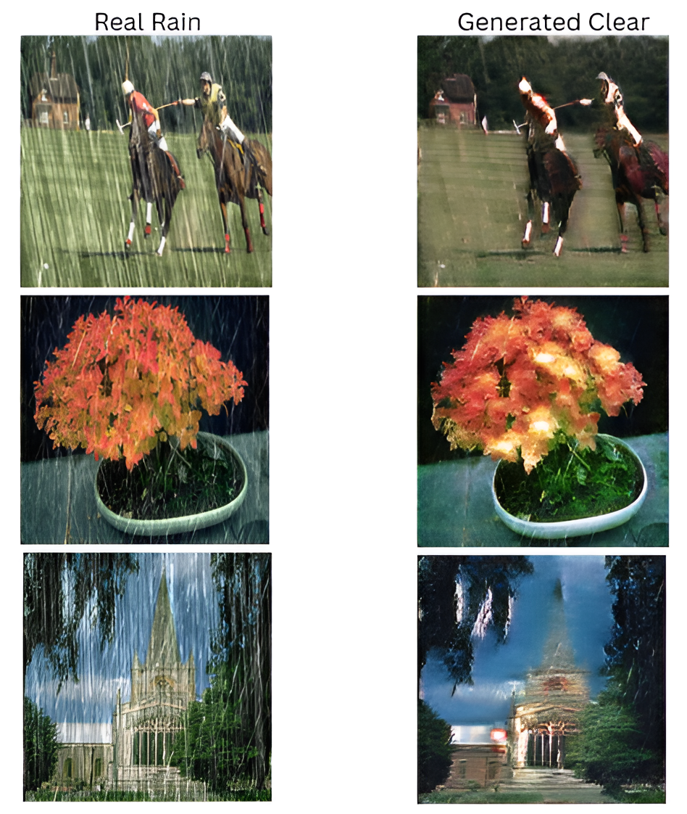

# CycleGAN-DeRain 

This project applies **CycleGAN** for image-to-image translation between two domains, focusing on rain removal. It uses a U-Net generator with skip connections to preserve details and a PatchGAN discriminator to evaluate local realism, enabling clear and realistic outputs from rainy images.
Team: @huntermilk007 @luzz216

# Architecture
Consists of two components:
- Generator (G) learns to transform the input image into the desired output image
- Discriminator (D) tries to distinguishes between the real image y and the generated one G(x)

# Generator
Follows a **U-net** architecture with:
- **Encoder**: A sequence of convolutional layers that progressively downsample the input
- **Decoder**: A sequence of transpose convolutions (up-convs) that upsample the input afterwards
- **Skip Connection**: Each encoder layer is directly connected to its corresponding decoder layer

But the question is: why this architecture? 
- **Encoder**: learns abstract, high-level features
- **Decoder**: reconstructs original image from vague information
- **Skip Connection**: ensure that local details are preserved, making the output sharper and more realistic

  

We also considered adopting a Multi-Path U-Net architecture to enhance generation quality. However, for the current implementation, we opted for a simpler design, as the more complex model would require significantly longer training time.

  

# Discriminator
We use **PatchGAN** architecture for the discriminator:
- Instead of classifying the entire image as real or fake, PatchGAN divides the image into **small overlapping patches**.
- Each patch is evaluated independently, and the outputs form a **grid of probabilities**.

Why is it efficient? 
- **Local Realism**: By focusing on small patches, PatchGAN encourages the generator to produce realistic details.
- **Efficiency**: Reduces the number of trainable parameters compared to full-image discriminators.

  

# Implementation

This project applies CycleGAN for rain removal in images. The model is trained to translate between two domains: Rainy → Clear and Clear → Rainy, ensuring cycle-consistency.

**Components** 
- 2 Generators $G_{AB}$ and $G_{BA}$
- 2 Discriminators $D_{A}$ and $D_{B}$

**Training Objectives**

Say $X$ in domain A, $Y$ in domain B
- Adversarial Loss:  $D_{B}(G_{AB}(X))$ versus real label, $D_{A}(G_{BA}(Y))$ versus real label

- Cycle Loss: $G_{AB}(G_{BA}(Y))$ versus $Y$, $G_{BA}(G_{AB}(X))$ versus $X$

- Identity Loss: $G_{AB}(Y)$ versus $Y$, $G_{BA}(X)$ versus $X$

  

**Dataset**

We use [SyraHQ dataset](https://www.kaggle.com/datasets/thisnameistaken/syrahq), which is a collection of 1000 clear images and 5000 rain images

**Training**

Using PyTorch on Kaggle

**Result**

  

# Conclusion

The model successfully removes rain from images, but performance is limited by the diversity of rain styles and can fail in some cases. Since our dataset uses paired rainy/clear images, efficiency drops sharply on unpaired real-world data. Furthermore, real applications like autonomous driving and surveillance require processing videos rather than single images. 

To overcome these issues, we are exploring **diffusion models** for more robust generation and **Mamba** for sequential video data. We will continue updating this repo with future research.

